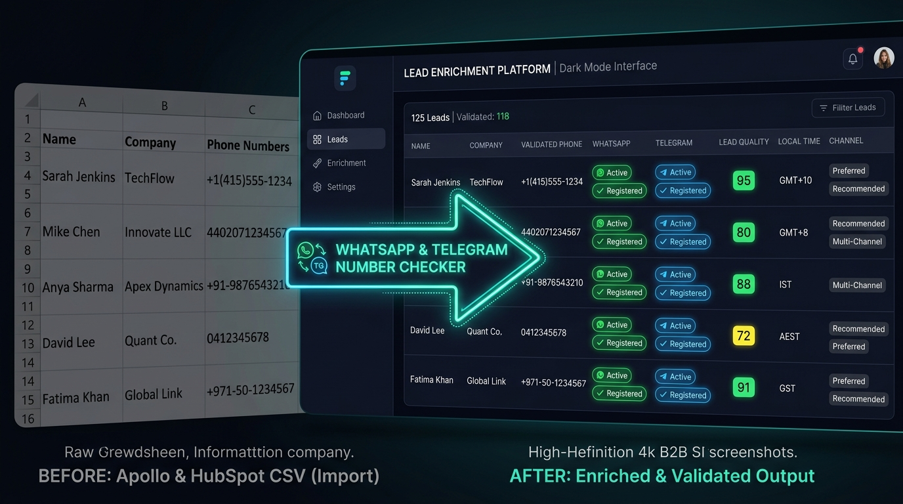

# NumChecker — Free WhatsApp & Telegram Number Validator for CRM Leads

  

  <a href="https://bilelbz.gumroad.com/l/xwkwpr"><b>🛒 Get Lifetime Access on Gumroad ($29)</b></a> •
  <a href="https://bilelbz.github.io/NumChecker/redeem.html"><b>🎁 Redeem AppSumo Code</b></a> •
  <a href="https://bilelbz.github.io/NumChecker/"><b>🌐 Official Website</b></a> •
  <a href="https://bilelbz.github.io/NumChecker/Documentation.html"><b>📖 Documentation</b></a>

---

## ⚡ What is NumChecker?

**NumChecker** is a standalone Windows desktop software that verifies bulk phone numbers for live **WhatsApp** and **Telegram** availability, detects mobile carriers, and calculates TCPA/GDPR compliance outreach hours — **with 100% zero recurring API fees**.

Built specifically for cold outreach teams, lead generation agencies, and growth hackers exporting contacts from Apollo.io, HubSpot, or Salesforce.

---

## 🔥 Key Features

- **Free WhatsApp Web Engine:** Link your WhatsApp via QR code once. Verify real WhatsApp & WhatsApp Business registrations directly from your desktop with zero Meta Cloud API fees.
- **Telegram Live & Premium:** Detect active Telegram accounts, public usernames, and identify high-value Telegram Premium subscribers automatically.
- **0–100 Lead Quality Scoring:** Evaluates line classification (Mobile vs VoIP/Burner lines) and multi-channel availability to generate an instant composite deliverability rating.
- **TCPA & GDPR Outreach Hours:** Automatically detects the lead's local timezone to indicate legal cold contact windows (Monday–Friday, 9:00 AM – 6:00 PM).
- **Full CRM CSV Passthrough:** Upload your Apollo or CRM CSV exports. All original columns are preserved untouched, with verified columns cleanly appended.
- **Standalone Windows .EXE:** No Python installation, no Docker, and no terminal commands required. Double-click `WhatsApp_Telegram_Validator.exe` and start immediately.

---

## 🚀 How to Get Started

1. **Purchase on Gumroad:** [https://bilelbz.gumroad.com/l/xwkwpr](https://bilelbz.gumroad.com/l/xwkwpr) (or redeem your code at [Redeem Page](https://bilelbz.github.io/NumChecker/redeem.html)).
2. Download and unzip your package.
3. Run `WhatsApp_Telegram_Validator.exe`.
4. Click **🔗 Link WhatsApp** to scan the QR code once with your phone.
5. Import your leads spreadsheet and click **▶ Start Validation**!

---

## 💻 System Requirements

- **Operating System:** Windows 10 or Windows 11 (64-bit)
- **Browser:** Google Chrome or Microsoft Edge installed (used for headless local WhatsApp session)

---

## 📞 Support & Community

- **User Documentation:** [Full Documentation & Manual](https://bilelbz.github.io/NumChecker/Documentation.html)
- **Official Site:** [https://bilelbz.github.io/NumChecker/](https://bilelbz.github.io/NumChecker/)
- **Author:** Bilel Bouzid
